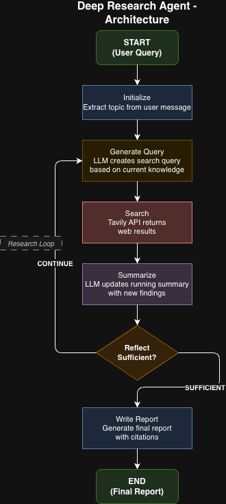

# Design Document

## Overview

Here I am outlining the architecture, design decisions, and implementation details of the Deep Research Agent.

---

## Architecture

### High-Level Flow





### State Definition

### State Management

The agent keeps track of everything it needs in a single state object called `ResearchState`. 

Here's what it stores:

- **messages** - This is where the conversation lives. The user's question comes in as a HumanMessage, and the final report goes out as an AIMessage. This follows the requirement of having a messages field in state.

- **topic** - The research topic pulled from the user's query. For example, if someone asks "What is quantum computing and why does it matter?", the topic would be that full question.

- **running_summary** - This is the heart of the agent. As it searches and finds information, it keeps building up this summary. Each iteration adds new findings to what's already there. By the end, this contains everything the agent learned.

- **sources** - A list of all the sources the agent found across all searches. Each source has a title, URL, and the content snippet. This is used for citations in the final report.

- **search_results** - The results from the most recent search only. This gets passed to the summarize step so it knows what new information to add. It's temporary and gets overwritten each search.

- **current_query** - Whatever search query the agent is currently using. Changes each iteration as the agent looks for different aspects of the topic.

- **iteration** and **max_iterations** - Simple counters to prevent infinite loops. The agent stops when it hits the max, even if it thinks it needs more research.
---

## Design Decisions

### Why "Local Deep Researcher" Pattern?

I read through a Towards Data Science article on building a deep research agent with LangGraph which gave me a good starting point. I also looked at LangChain's own open source implementations - open_deep_research and local-deep-researcher - to understand how they approached the problem.
After comparing a few patterns, I went with something closest to the Local Deep Researcher approach. The main reason was that it's adaptive - each search builds on what's already been learned - without being overly complex to implement.

#### Option 1: Simple Linear Pipeline
```
Query → Search → Summarize → Write Report
```

**Pros:**
- Simple to implement
- Fast execution

**Cons:**
- Only searches once
- No depth - misses important aspects
- Can't adapt based on findings

**My Decision:** Too shallow for "deep" research.

#### Option 2: Fixed Plan-Execute
```
Query → Generate 5 Sub-questions → Search Each → Write Report
```

**Pros:**
- Covers multiple aspects
- Predictable behavior

**Cons:**
- Plan is fixed upfront
- Can't adapt if search reveals unexpected information
- Might miss important angles not anticipated in planning

**My Decision:** Better, but not adaptive enough.

#### Option 3: Multi-Agent (Supervisor/Workers)
```
Query → Supervisor → [Worker Agents] → Synthesize → Report
```

**Pros:**
- Highly sophisticated
- Can parallelize research
- Each agent can specialize

**Cons:**
- Complex to implement
- Harder to debug
- Overkill for the time constraint

**My Decision:** Too complex for this project scope.

#### Option 4: Local Deep Researcher (Chosen)
```
Query → [Generate Query → Search → Summarize → Reflect]* → Write Report
```

**Pros:**
- Adaptive: each query informed by current knowledge
- Iterative: continues until sufficient information
- Reflection: intelligently decides when to stop
- Manageable complexity

**Cons:**
- Sequential (not parallel)
- Reflection can sometimes stop too early or too late

**My Decision:** Best balance of sophistication and implementability.

### Why This Pattern Works

The whole idea behind this approach is that the agent doesn't just fire off random searches. Instead, each search query is shaped by what the agent has already learned.
So if you ask about "quantum computing", the first search might be something broad like "introduction to quantum computing". But once the agent has the basics down, it doesn't search for the same thing again. It looks at what's missing and searches for that instead - maybe "quantum computing real world applications" or "recent breakthroughs in quantum computing 2024".
It's basically how you'd research something yourself. You don't Google the same thing five times. You start broad, see what you get, then dig deeper into the parts you don't fully understand yet.

---

## Internal Messages Handling

### My Approach

I chose to store internal data in **separate fields** rather than in the `messages` field:

The user's original query and the final report both go in the messages field - query as a HumanMessage, report as an AIMessage. This keeps the main input/output clean and follows the requirement.

Everything else gets its own field. Search queries go in current_query, search results get stored in both sources (all results across searches) and search_results (just the latest batch). The running summary builds up in running_summary as the agent learns more.

I could have stuffed all of this into messages as intermediate steps, but keeping them separate made the code much easier to work with and debug.


### Why Separate Fields?

1. **Cleaner State Management**: Each piece of data has a dedicated field, making it easier to access and update.

2. **Easier Debugging**: When something goes wrong, I can inspect specific fields rather than parsing through a long message list.

3. **Flexibility**: The `messages` field stays clean for the primary use case (query in, report out), while internal data is accessible when needed.

4. **Verbose Mode**: For visibility into internal workings, I implemented a `--verbose` flag that prints LLM calls, search results, and decisions in real-time.

### Alternative Considered

I considered storing everything in `messages`:

```python
messages = [
    HumanMessage(content="What is quantum computing?"),
    AIMessage(content="Searching for: quantum computing basics"),
    ToolMessage(content="Found 5 results: ..."),
    AIMessage(content="Updated summary: ..."),
    AIMessage(content="# Final Report...")
]
```

**Why I didn't choose this:**
- Makes `messages` very long and harder to parse
- Mixes different types of content
- The final report would need to be extracted from the end

---
## What I Tried

### 1: Using `_search_results` (Underscore Prefix)

Initially, I stored temporary search results in `_search_results` thinking the underscore would indicate it's internal.LangGraph doesn't persist keys starting with `_` to state. The summarize node couldn't access the search results. I Renamed to `search_results` (no underscore) and added it to the state definition.

### 2: Verbose Output via `_verbose` Dict

I tried returning verbose information in a `_verbose` dictionary from each node:

```python
return {
    "current_query": query,
    "_verbose": {"prompt": prompt, "response": response}
}
```
 The `_verbose` data wasn't being passed through LangGraph's streaming properly. I Changed to direct printing within nodes when `verbose_mode` is enabled. This is simpler and more reliable.

### 3: Streaming with `graph.stream()` + `graph.invoke()`

Initially used `graph.stream()` to show progress, then `graph.invoke()` to get results. This ran the graph twice - once for streaming, once for results.I used only `graph.invoke()` with verbose printing happening inside the nodes.

---

## What Worked Well

1. **Adaptive Query Generation**: The LLM effectively generates different queries based on the running summary. First query is broad, subsequent queries fill gaps.

2. **Reflection Mechanism**: The LLM accurately determines when research is sufficient. It considers both content coverage and iteration count.

3. **Incremental Summarization**: Building the summary incrementally (rather than at the end) helps manage context window and produces better synthesis.

4. **Tavily Search**: Returns clean, relevant results with content snippets. The "advanced" search depth provides better quality than "basic".

5. **Verbose Mode**: Extremely helpful for debugging and demonstrating how the agent works.

---

## What Didn't Work Well

- **Reflection stops too early** - Sometimes the LLM decides it has "enough" information after just one or two searches, even when the summary is pretty shallow. I think this could be fixed by requiring at least a couple of iterations before the agent is even allowed to stop, or by tweaking the reflection prompt to be more critical.

- **Redundant information** - Different searches sometimes return overlapping information, and the summary ends up repeating itself. The summarization prompt tells the LLM to avoid repetition, but it doesn't always work. A smarter fix would be to deduplicate the search results before summarizing, or to be more aggressive in the prompt about skipping information that's already covered.

- **No source quality checks** - Right now, a random blog post gets treated the same as a research paper from MIT. They all just get dumped into the summary equally. Ideally, there'd be some scoring based on domain authority or how recent the source is, so the agent prioritizes better sources.

---

## Known Shortcomings

### 1. Sequential Searches
Currently, searches happen one at a time. For a topic requiring 5 searches, this means 5 sequential API calls. I can use LangGraph's parallel execution to run multiple searches concurrently when generating the initial queries.

### 2. No Caching
Repeated queries hit the APIs every time, wasting time and money. I can implement a caching layer (Redis or SQLite) for search results with TTL-based expiration.

### 3. No Rate Limiting
Rapid consecutive queries could hit API rate limits. I can implement rate limiting and queuing for API calls.

---

## Future Features

If I had more time, I would add:

### 1. Multiple LLM Support
- Add Anthropic Claude, Google Gemini as options
- Allow model selection per task (cheaper model for queries, better model for report)

### 2. Multiple Search Providers
- Support Exa, SerpAPI, Bing in addition to Tavily
- Aggregate results from multiple sources

### 3. Human-in-the-Loop
- Allow user to approve/modify the research plan
- Let user request deeper research on specific sections

### 4. Memory/Context
- Remember previous research sessions
- Build on past research for related queries

---
## Testing Strategy

I split the tests into two groups. Unit tests cover the individual pieces - making sure the state structure is right, config defaults work, and each node function does what it's supposed to with mocked LLM and search responses. These run fast and don't need any API keys, so you can run them constantly while developing. Integration tests are the opposite - they hit the real APIs and test the whole flow from query to final report, including edge cases like really short queries or complex multi-part questions. These take longer and cost money, so they're more for running before you commit or deploy rather than after every change.

---

## Conclusion

The Local Deep Researcher pattern proved to be an effective approach for building a deep research agent. Its adaptive nature - where each search is informed by previous findings - produces comprehensive reports that cover topics from multiple angles.